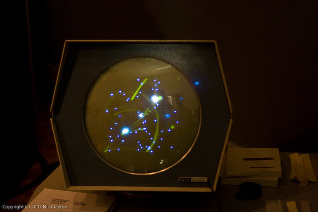
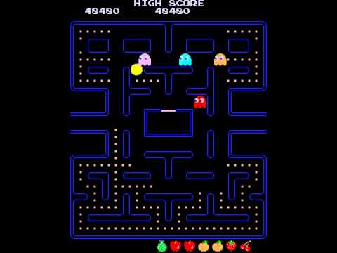
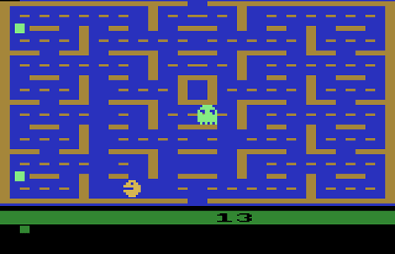
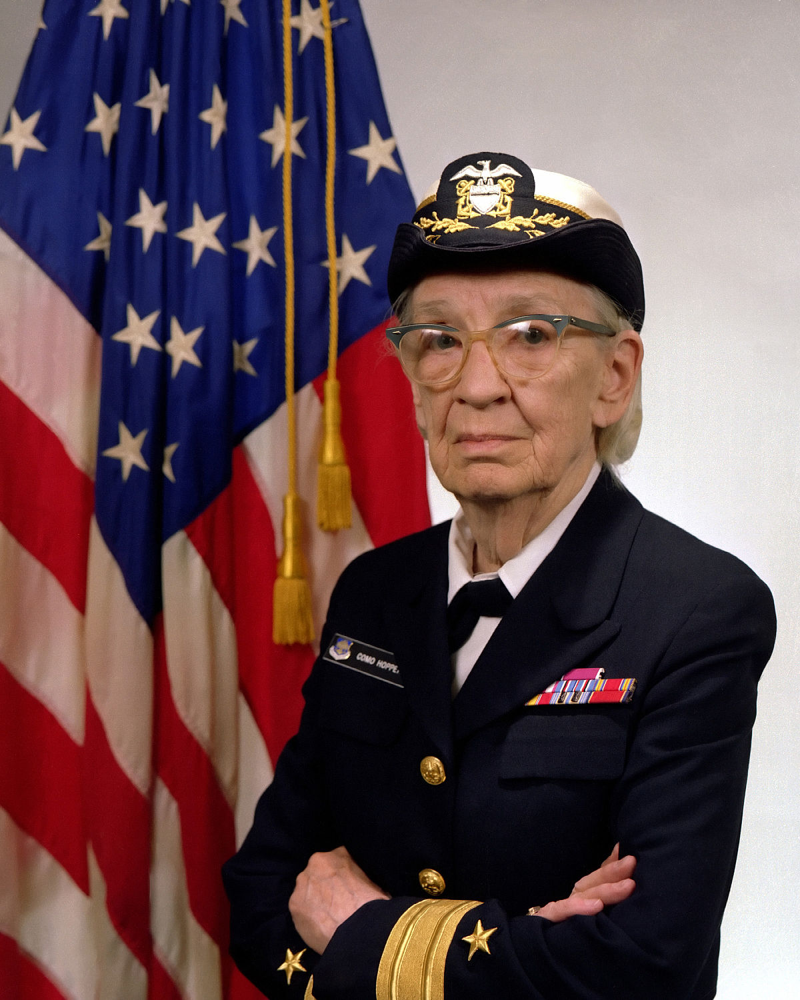
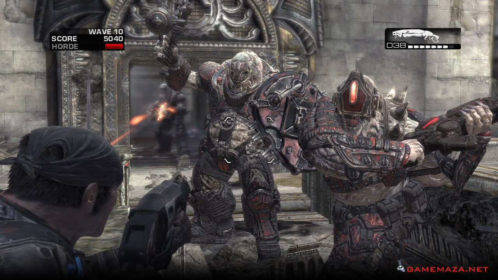

% Game Development
% EDGE Game Development Camp
% \today

# Introductions

## Welcome!

We are all glad that you are here!

## A quick word from our sponsor.

- This camp is sponsored by GOOGLE. We would like to thank them for providing the resources to make this camp possible.
- If you enjoy this camp and the skills, consider applying for a job a Google.

## Who are we? 

- Instructor:
    - James Church
- Camp Programming Experts:
    - Jacob Horstman
    - Mikayla Webber
    - Ethan Shircel
    - Bridget Cloud

## Why are we here?

. . .

- To make video games!

. . .

- To learn how computers work.

. . .

- To see if we are interested in the study of technology and engineering in University.

. . .

- To possibly use this camp to launch a career in the technology field.

# What are games?

. . .

- Games are a structured form of play.
- Games have three components.
    - Rules
    - One or more goals.
    - Choice

## Rules

A game should have rules.

- Rules dictate what a player is allowed to do and the order in which they are allowed to do it.
- An activity with a goal and choice but without rules is considered "puzzle".
    - Jigsaw Puzzles
    - Rubric's Cube

## Goals

A game should have one or more goals.

- Goals motivate the players to keep playing to meet an objective.
- Some games can have multiple objectives, any one of which triggers the end of the game.
- An activity without goals will cause the players to do one of two things:
    - Implicitly create their own goals to fill the void.
    - Get bored with the game and do something else.
- This can happen even when your game has a clear goal.

## Choice

A game should allow a player to make choices.

- Choices allow the player to control their destiny.
- Activities with rules and goals but without choice are called "Games of Chance".
    - Candyland
    - War
    - Snakes and Ladders
    - Slot Machines
    - Lottery

## What are different types of games?

. . .

- Sports (baseball, football, hockey, basketball, soccer, etc.)
- Dexterity (Jenga, Twister)
- Board (Monopoly, Settlers of Catan, etc.)
- Pencil-And-Paper (Dungeons and Dragons, GURPS, etc.)
- Card (Uno, Magic: The Gathering, Pokemon)
- Dice (Shut the Box, Yahtzee, Farkle, Liar's Dice, Craps)
- Video Games!

## Video games

- Video games have been with us since the 1960s since computer scientists began working on interactive demonstrations for their new computers.
- The first video game was called "Spacewar!" and was developed at MIT in 1962.
- The game involves two space ships flying around a 2D space. The goal of each ship is to shoot the other.
- Spacewar was created using assembly language on the PDP-1.

## Spacewar! The first video game

# How video games are made.

## Assembly

- In the early days, all games were written in assembly, usually by a single person.
    - Assembly code is language which written for a particular computer architecture and probably will not work on a different machine.
    - If you wanted to play a game, you had to make sure that the code existed for your computer architecture.
    - If it didn't exist, the game would have to be rewritten from scratch or you went without.

## Assembly

- Assembly has advantages: it is considered the fastest language to use when a computer is slow.
- Assembly has disadvantages: the same game might have to be written multiple times to reach a mass audience.
    - The arcade version of Pac-Man looks very different from the home Atari version of Pac-Man.
- Assembly is called a "low level language".

## Arcade Pac-Man

## Atari Pac-Man

## High-Level Languages

- As time went on, developers became smarter about how they wrote software, including games.
- A **compiler** allows developers to write in a **high-level language** and then translate that code in into assembly language (a **low-level language**).
- The assembly language generated by a compiler is almost as fast as assembly language written by a programmer.
- This allows programmers to write a game once, yet work on multiple machine architectures. 
- The compiler was invented by Grace Hopper.
- Most Nintendo games are written in C++.
- C++ is taught here at APSU in the CS 1010, CS 2000, and CS 2010 courses.

## Grace Hopper, inventor of the compiler

## High-Level Interpreted Languages

- Computers in the 90s became faster.
- The language **Java** is a high-level compiled language that is translated into its own special code called **bytecode**.
- To run a Java program, you need a program that translates **bytecode** to **assembly** on the fly.
    - This program is called a Virtual Machine.
- Any program written in Java will work on any computer with the Java Virtual Machine.
- This is slower than direct-to-assembly languages, but computers were faster and that's okay.
- The most famous game written in Java is **Minecraft** in 2011.
- Java is taught at APSU in the CS 1015 course.

## James Gosling, inventor of Java (1996)

## Markus "Notch" Perrson, creator of Minecraft (2011)

## Microsoft wants to game.

- In 2006, Epic Games released Gears of War for the XBox 360.
- This game is noteworthy because it represented a change in video gaming away from C++.
- This game used the Microsoft language called C#, which is similar to Java in both language structure and internal design.
- Like Java, it's a compiled language that uses an interpreter to convert on-the-fly into assembly.
- C# is taught at APSU in the CS 3005 course.

## Gears of War (2006)

## Game Engines

- Most games are no longer created from scratch.
- Games are created in a game engine.
    - Phase 1: Developers will create or purchase a game engine that will give them the features that are desired in a game.
    - Phase 2: Developers will then create the game within that engine.
- There are many game engines and most are specialized for a particular type of game (such as FPS, RPG, or RTS).

## Unity

- The **Unity** game engine is a free-for-personal use game engine that is used to create games on platforms such as XBox, Nintendo DS, Android, and WebGL.
- Unity has a built-in physics simulation engine allows users to create real-time physics games, such as as pinball.
- Unity has a built-in framework for creating both 2D and 3D games with the click of a button.
- The primary language of Unity is C#.
- Unity is free for commercial use up to $100,000.
- Games made with Unity: Kentucky Route Zero, Pokemon GO, Angry Birds Epic, and Fallout Shelter.

## Unity

## Unity

- We are learning Unity and the C# language.

## Hard Truth about Game Development

- Game development is a slow, sometimes frustrating, process while also a rewarding processing.
- Don't let the frustration get to you.
- There is a lot to learn. Don't be afraid to ask questions.
- Game development is equal parts programming, math, and art.
- It's fun to play games.
- It's even more fun to watch someone play a game that you made.

## Question to you.

- What kind of games would you like to make this week?
- We will be lucky to create one game per day.

## First Game

Our first game will be Brick Breaker.
